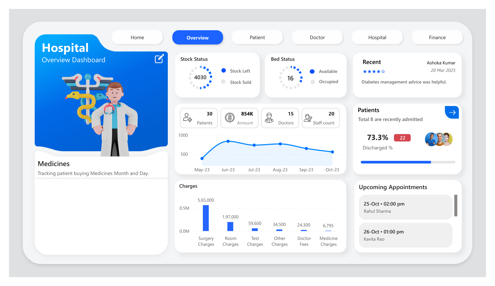
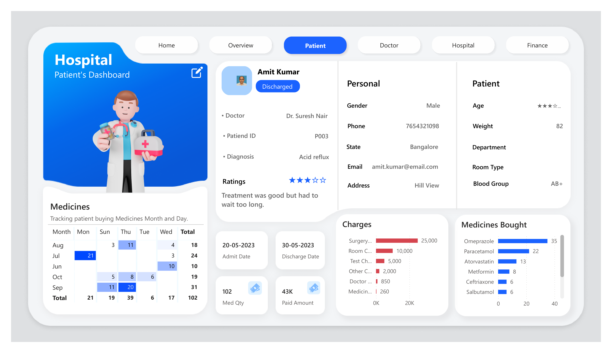
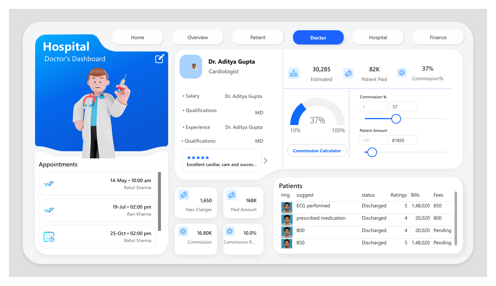
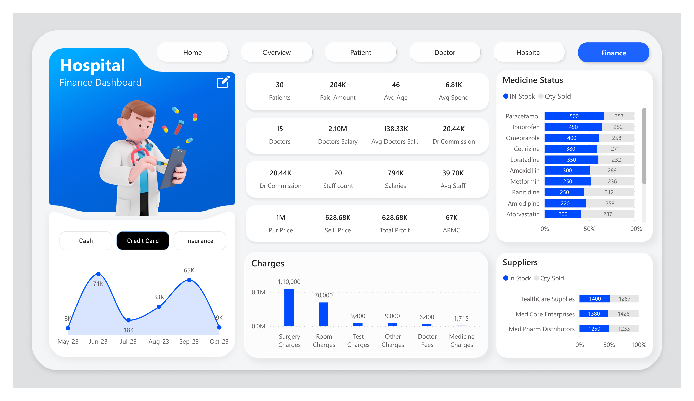

# 🏥 Healthcare Operations Analytics – Power BI Dashboard

### 🔗 [View Live Dashboard](https://app.powerbi.com/view?r=eyJrIjoiYWRkNGNhNWUtZTdkYy00MmY1LWI3ZDAtMjAyOTIxM2Y0NjI0IiwidCI6IjA3ZTE4NGQ1LTU2YmYtNDlkMC1hNWNkLTIzYzA1YzFiZWQwZiJ9)

An end-to-end **Power BI analytics dashboard** built to analyze hospital operations data and deliver actionable insights across **patient care, doctor performance, bed & ward utilization, medicine inventory, and financial health**.
This project focuses on translating a raw multi-table hospital dataset into a relational data model, DAX-driven calculations, and a professional, stakeholder-ready 5-page dashboard.

---

## 📌 Project Overview

A hospital generates data across dozens of disconnected touchpoints daily — admissions, doctor schedules, billing, medicine stock, and supplier orders. Turning that raw operational data into **decisions** — on bed allocation, doctor commission payouts, and inventory planning — requires a structured analytics layer.
This project builds that layer end-to-end: data staged in Excel, structured in MySQL, and delivered as a **5-page Power BI dashboard** covering hospital-wide KPIs, individual patient records, doctor performance, facility operations, and finance.

---

## 🎯 Business Objectives

- Track overall patient volume, revenue, and discharge efficiency
- Give doctors and administrators a live, interactive view of commission payouts
- Monitor bed occupancy across General, Private, and ICU wards
- Track medicine stock levels against sales to flag overstock or shortage risk
- Surface patient-level clinical and billing history in one place
- Support staffing, pricing, and inventory decisions with consolidated financial data

---

## 📂 Dataset Overview

The dataset is **hospital operations data** modeled around Patient, Doctor, Billing, Appointment, and Inventory tables, staged in Excel and structured in MySQL. It includes:

- Patient ID, Name, Gender, Age, Weight, Blood Group, Department, Room Type
- Admit Date, Discharge Date, Diagnosis, Status (Discharged/Admitted), Rating & Review
- Doctor ID, Name, Specialization, Qualifications, Experience, Salary
- Charges by category — Surgery, Room, Test, Other, Doctor Fees, Medicine
- Payment mode — Cash, Credit Card, Insurance
- Bed data by ward type — General, Private, ICU (Occupied/Available)
- Medicine name, stock quantity, quantity sold, supplier
- Appointment date/time, reason, and status

---

## 🧱 Dashboard Architecture

The report is structured into **five analytical pages**, each serving a specific operational function:

1. Overview
2. Patient
3. Doctor
4. Hospital
5. Finance

A page navigator allows seamless movement between pages.

---

## 📊 Page-wise Business Explanation

---

### 1️⃣ Overview

**Business Requirement** Give stakeholders a single executive view of hospital-wide performance — patients, revenue, stock, and beds — at a glance.

**KPIs Displayed**

- Total Patients — **30**
- Total Amount Collected — **₹854K**
- Total Doctors — **15**
- Staff Count — **20**
- Discharge Rate — **73.3%**
- Stock Left — **4,030 units**
- Beds Available — **16**

**Key Features**

- Donut visuals for **Stock Status** (Stock Left vs. Stock Sold) and **Bed Status** (Available vs. Occupied)
- 6-month patient volume trend line (May–Oct '23)
- Charges breakdown bar chart by category — Surgery leads at ₹5,65,000, followed by Room (₹1,97,000), Test (₹59,600), Other (₹34,500), Doctor Fees (₹24,300), and Medicine (₹6,795)
- Discharge % tracker (73.3%, 22 discharged of recent admissions, 8 currently admitted)
- Recent patient review card and an upcoming appointments list
- Medicine purchase tracking matrix (patients buying medicines by month/day)

**Business Value**

- Gives administrators a quick, executive-level read on patient flow, revenue, and capacity
- Flags which charge category is driving the bulk of hospital revenue
- Surfaces inventory and bed capacity risk in one glance

---

---

### 2️⃣ Patient

**Business Requirement** Give care coordinators and billing staff a 360° view of any individual patient — clinical, personal, and financial — searchable by patient.

**KPIs Displayed**

- Medicine Quantity — **102**
- Amount Paid — **₹43K**
- Length of Stay — **Admit to Discharge date range**

**Key Features**

- Patient profile card — name, status, assigned doctor, patient ID, diagnosis, and star rating with written review
- **Personal panel** — gender, phone, state, email, address
- **Clinical panel** — age, weight, department, room type, blood group
- Itemized charges breakdown per patient (Surgery ₹25,000 down to Medicine ₹260)
- **Medicines Bought** ranked bar chart (Omeprazole, Paracetamol, Atorvastatin, Metformin, Ceftriaxone, Salbutamol)
- Medicine purchase calendar heatmap by month and day-of-week
- Patient selector chips to switch between patients instantly

**Business Value**

- Consolidates a patient's full clinical, billing, and medication history into one screen
- Speeds up discharge summaries and insurance/billing reconciliation
- Highlights medication patterns for pharmacy and stock planning

---

---

### 3️⃣ Doctor

**Business Requirement** Give hospital administration a live, interactive view of each doctor's caseload, ratings, and commission payout — with the ability to model different commission scenarios.

**KPIs Displayed**

- Estimated Revenue — **₹30,285**
- Patient Paid — **₹82K**
- Commission Rate — **37%**
- Fees Charges — **₹1,650**
- Paid Amount — **₹168K**
- Commission Earned — **₹16.80K**

**Key Features**

- Doctor profile card — name, specialization, qualifications, experience, and patient reviews
- **Commission Calculator** — an interactive DAX **What-If Parameter**, with live sliders for Commission % (10–100%) and Patient Amount, recalculating payout in real time
- Appointments list with dates and patient names
- Patients table — treatment/suggestion given, discharge status, rating, bill amount, and fee, per doctor
- Doctor selector to switch the entire page context

**Business Value**

- Turns a static commission structure into a scenario-modeling tool for admin and finance teams
- Gives doctors visibility into their own patient load, ratings, and earnings
- Standardizes commission calculation logic across all doctors in one model

---

---

### 4️⃣ Hospital

**Business Requirement** Give operations staff a facility-wide view of capacity, testing pipeline, and scheduling load, independent of any single patient or doctor.

**KPIs Displayed**

- Patient distribution by age band
- Bed occupancy by ward type (General, Private, ICU)
- Live surgery and appointment schedules

**Key Features**

- **Patient by Age Category** bar chart — 31–45 is the largest segment (13 patients), followed by 46–60 (10), 60+ (4), and 18–30 (3)
- **Patient Tests Status** filterable table — test name, clinical notes, and completion status per patient
- **Beds Status** stacked bar chart by ward — General, Private, ICU — split by Occupied vs. Available
- Surgeries schedule list and hospital-wide **Doctor's Appointments** table (doctor, patient, reason, status)
- Quick-filter patient chips and an "All" status dropdown on the tests table

**Business Value**

- Identifies which ward type is closest to capacity for bed allocation decisions
- Flags the dominant patient age demographic for preventive care targeting
- Gives a single scheduling view across every doctor and surgery in the facility

---

---

### 5️⃣ Finance

**Business Requirement** Give the finance team a consolidated view of revenue, payroll, profitability, and inventory value — cutting across patients, doctors, and suppliers.

**KPIs Displayed**

- Paid Amount — **₹204K**
- Average Spend per Patient — **₹6.81K**
- Doctors' Salary (Total) — **₹2.10M**
- Doctor Commission (Total) — **₹20.44K**
- Staff Salaries (Total) — **₹794K**
- Purchase Price — **₹1M** | Sell Price — **₹628.68K** | Total Profit — **₹628.68K**
- ARMC — **₹67K**

**Key Features**

- Payment mode toggle — **Cash / Credit Card / Insurance** — driving a 6-month revenue trend line (peaks of ₹71K in Jun and ₹65K in Sep)
- Hospital-wide charges breakdown by category (Surgery ₹1,10,000 down to Medicine ₹1,715)
- **Medicine Status** — stock-on-hand vs. quantity sold for the top 10 medicines
- **Suppliers** panel comparing stock vs. sold across 3 suppliers (HealthCare Supplies, MediCore Enterprises, MediPharm Distributors)
- Full payroll rollup — doctors, staff, average salary, and commission, in one page

**Business Value**

- Connects clinical activity directly to profitability (purchase price vs. sell price vs. profit)
- Flags which payment mode the hospital is most reliant on
- Identifies overstock or shortage risk at both the medicine and supplier level

---

---

## 🛠 Tools Used

| Tool | Role in This Project |
|---|---|
| **Microsoft Excel** | Direct-import source files for patients, doctors, billing, appointments, and inventory |
| **MySQL** | Relational database structuring the hospital data before modeling |
| **Power BI Desktop** | Data modeling, Power Query transformations, DAX measures, and the final 5-page report |
| **Figma** | Wireframing and visual layout design for the dashboard's card-based UI before building it out in Power BI |

---

## 🛠 Tools & Technologies Used

- **Power Query (M)** — data cleaning, shaping, and loading from MySQL into the Power BI model
- **DAX (Data Analysis Expressions)** — KPI measures, discharge %, average spend/salary calculations
- **DAX What-If Parameters** — the live Commission Calculator on the Doctor page
- KPI Card Design & Multi-Page Dashboard UX

---

## 📈 Business Impact

This dashboard enables hospital administration to:

- Track patient volume, revenue, and discharge efficiency at a glance
- Model doctor commission payouts interactively before finalizing them
- Monitor bed occupancy by ward type to plan capacity
- Catch medicine overstock or shortage risk against supplier data
- Move from a single patient record to hospital-wide financials without leaving the report

---

## 📚 Key Learnings

- Structuring a multi-entity hospital dataset (patients, doctors, billing, inventory) into a clean relational model in MySQL
- Building an interactive What-If Parameter to turn a static commission % into a live calculator
- Designing patient-level and doctor-level drill-down views inside a single report
- Balancing an executive Overview page against detailed operational pages (Patient, Doctor, Hospital, Finance)
- Translating scattered hospital operations data into a single stakeholder-ready analytics product

---

## 🚀 Future Enhancements

- Predictive length-of-stay modeling by diagnosis and age group
- Automated low-stock alerts tied to supplier reorder points
- Doctor performance scoring combining ratings, caseload, and revenue
- Real-time/near-real-time data refresh from the MySQL source

---

📌 GitHub Repository:
<https://github.com/whoisaustin7/Healthcare-Operations-Analytics>

---

## 📎 Note

This project was built end-to-end — Excel source files structured into a MySQL relational database, modeled and visualized in Power BI Desktop using Power Query and DAX, including an interactive What-If Parameter for doctor commission calculations.
